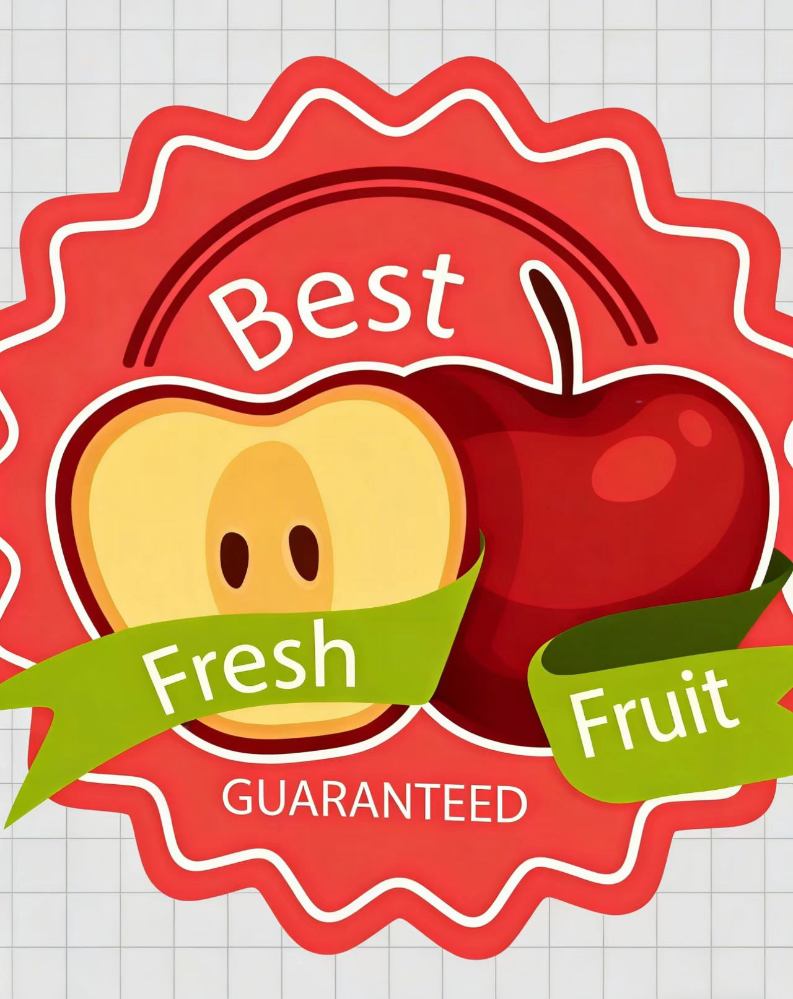
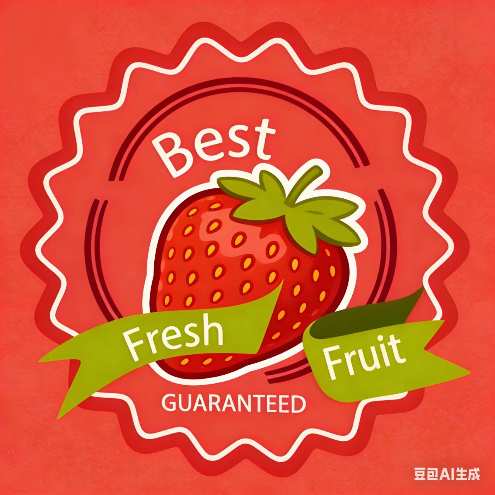
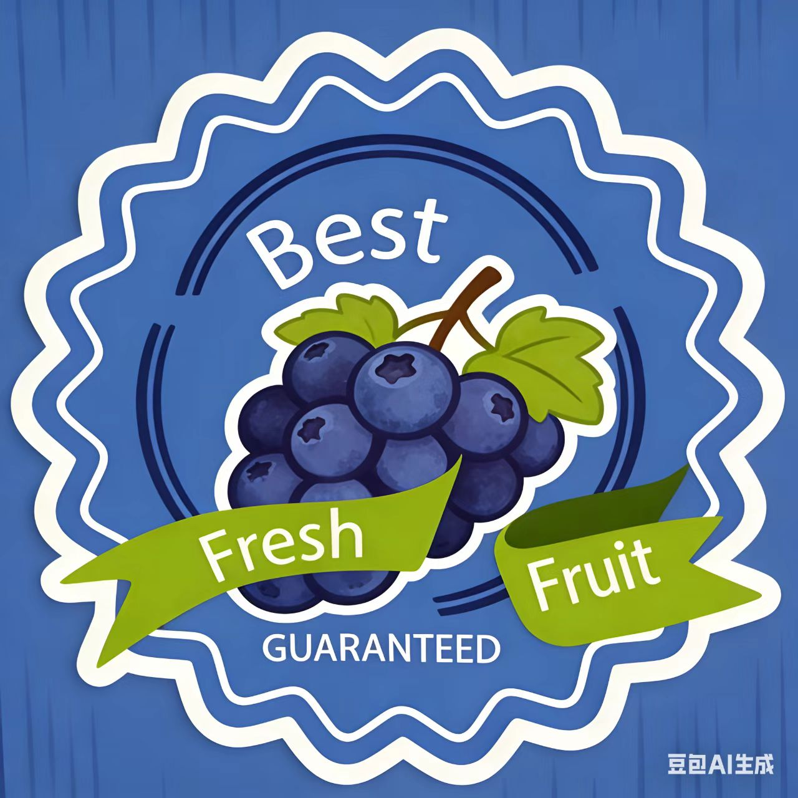

# 溶贴易通 - 微信小程序

<p align="center">
  
</p>

<p align="center">
  <b>专业定制可溶性商标 - 食品级安全，环保可降解</b>
</p>

---

## 📱 项目简介

溶贴易通是一款基于微信小程序平台开发的电商应用，专注于提供可溶性商标定制服务。产品广泛应用于水果、蔬菜等农产品标识，具有食品级安全、环保可降解的特点。

---

## ✨ 核心功能

### 🏪 商品展示
- **首页推荐**：展示热门商品和推荐内容
- **商品分类**：水果类、蔬菜类、定制类三大分类
- **商品搜索**：支持关键词实时搜索
- **商品详情**：查看商品信息、价格、库存

### 🛒 购物车
- 添加商品到购物车
- 调整商品数量
- 全选/单选商品
- 实时计算总价

### 💳 订单系统
- **确认支付**：选择收货地址、支付方式
- **订单管理**：查看待付款、待发货、待收货、待评价订单
- **订单详情**：查看订单状态、商品信息、物流信息

### 👤 用户中心
- 个人资料管理
- 收货地址管理（添加、编辑、删除）
- 优惠券管理（未使用、已使用、已过期）
- 我的收藏
- 浏览历史
- 客服中心
- 常见问题

---

## 🚀 技术栈

| 技术 | 说明 |
|------|------|
| **Uni-app** | 跨端开发框架 |
| **Vue 3** | 前端框架 |
| **Vite** | 构建工具 |
| **微信小程序** | 运行平台 |

---

## 📦 项目结构

```
uni-preset-vue-vite/
├── src/
│   ├── pages/              # 页面文件
│   │   ├── index/          # 首页
│   │   ├── shop/           # 商品列表
│   │   ├── product/        # 商品详情
│   │   ├── cart/           # 购物车
│   │   ├── orders/         # 订单相关
│   │   ├── mine/           # 个人中心
│   │   ├── login/          # 登录注册
│   │   ├── address/        # 收货地址
│   │   ├── coupons/        # 优惠券
│   │   └── ...             # 其他页面
│   ├── static/             # 静态资源
│   ├── App.vue             # 应用入口
│   ├── main.js             # 主入口文件
│   ├── pages.json          # 页面配置
│   └── manifest.json       # 应用配置
├── dist/                   # 编译输出目录
├── package.json            # 项目依赖
└── vite.config.js          # Vite配置
```

---

## 🔧 安装与运行

### 环境要求
- Node.js >= 16.0.0
- npm 或 yarn
- 微信开发者工具

### 安装步骤

1. **克隆项目**
```bash
git clone https://github.com/lishao627/rongtie-yitong-miniapp.git
cd rongtie-yitong-miniapp
```

2. **安装依赖**
```bash
npm install
```

3. **运行开发服务器（H5）**
```bash
npm run dev:h5
```

4. **运行微信小程序**
```bash
npm run dev:mp-weixin
```

5. **使用微信开发者工具**
   - 打开微信开发者工具
   - 选择 "导入项目"
   - 选择 `dist/dev/mp-weixin` 目录
   - 填写自己的 AppID（或选择测试号）
   - 点击确定运行

---

## 📱 功能截图

<p align="center">
  
  
  
</p>

---

## 🛍️ 商品列表

| 商品名称 | 价格 | 分类 |
|---------|------|------|
| 苹果可溶性商标 | ¥19.9 | 水果类 |
| 梨可溶性商标 | ¥21.9 | 水果类 |
| 草莓可溶性商标 | ¥28.9 | 水果类 |
| 蓝莓可溶性商标 | ¥32.9 | 水果类 |
| 葡萄可溶性商标 | ¥26.9 | 水果类 |
| 生菜可溶性商标 | ¥18.9 | 蔬菜类 |
| 西红柿可溶性商标 | ¥20.9 | 蔬菜类 |
| 定制水果商标 | ¥29.9 | 定制类 |
| 定制蔬菜商标 | ¥27.9 | 定制类 |
| 企业定制商标 | ¥39.9 | 定制类 |

---

## 🎯 使用流程

1. **浏览商品**：首页或商品列表页浏览商品
2. **选择商品**：点击商品查看详情，选择规格
3. **加入购物车**：添加商品到购物车
4. **结算支付**：选择收货地址，确认支付
5. **查看订单**：在个人中心查看订单状态

---

## 🔐 账号信息（测试用）

> 当前版本为演示版本，登录功能为原型交互，可直接点击登录进入。

---

## 📄 开源协议

本项目仅供学习交流使用。

---

## 👥 联系我们

如有问题或建议，欢迎通过以下方式联系：

- 邮箱：您的邮箱@example.com
- GitHub Issues：[提交问题](https://github.com/lishao627/rongtie-yitong-miniapp/issues)

---

<p align="center">
  <b>溶贴易通 - 让商标更环保，让品牌更出彩</b>
</p>
